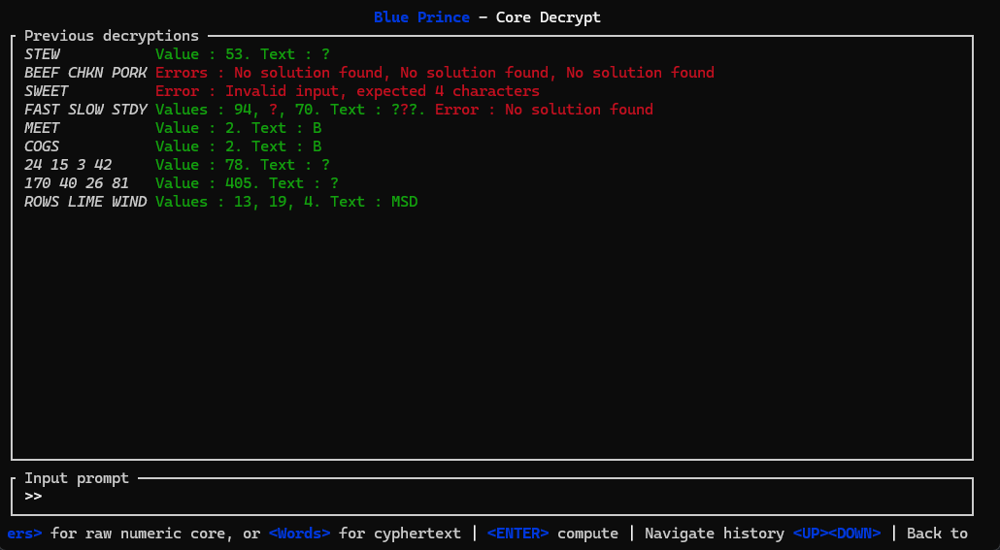
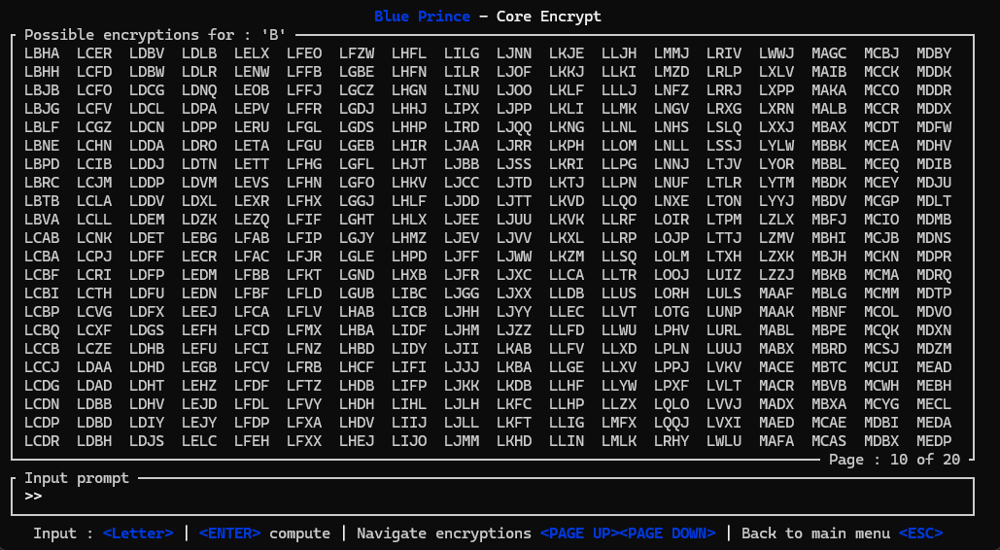

# Blue Prince - Core calculator
A small Terminal-UI application to solve a puzzle in the video game `Blue Prince`

Game official website [https://www.blueprincegame.com/]  
Steam : [https://store.steampowered.com/app/1569580/Blue_Prince/]

# Screenshots

# Features
- Decrypt a numeric core from 4 numbers
- Decrypt a numeric core from 4-letter words
- Encrypt all possible words that match a character

# Licence
MIT : do what you want with it. No warranty
